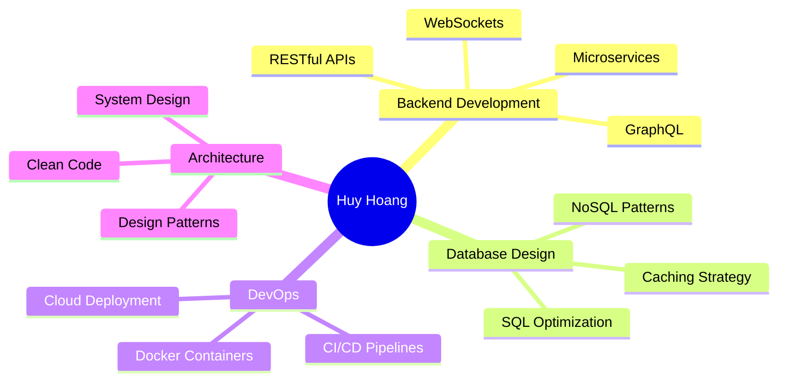

# <div align="center">👋 Hi, I'm Huy Hoang</div>

<div align="center">
  
</div>

<div align="center">
  
  
</div>

---

## Tech Stack

<div align="center">

### 🔹 Backend Development


### 🔹 Frontend Development  


### 🔹 Database & Caching


### 🔹 DevOps & Tools


### 🔹 Development Tools


</div>

---

## GitHub Analytics

<div align="center">
  
  
</div>

<div align="center">
  
  
</div>

<div align="center">
  
</div>

---

## GitHub Trophies

<div align="center">
  
</div>

---

## What I'm Currently Working On

```typescript
const huyhoang = {
  code: ["TypeScript", "JavaScript", "Java", "Python"],
  technologies: {
    backend: {
      nodejs: ["Express", "NestJS", "Fastify"],
      java: ["Spring Boot", "Hibernate"],
      python: ["FastAPI", "Django"]
    },
    databases: ["PostgreSQL", "MongoDB", "Redis", "MySQL"],
    devOps: ["Docker", "Kubernetes", "Nginx", "CI/CD"],
    tools: ["Git", "Postman", "VSCode", "Linux"]
  },
  architecture: ["Microservices", "RESTful APIs", "GraphQL", "Event-Driven"],
  currentFocus: "Building scalable backend systems with clean architecture",
  funFact: "I debug with console.log() and I'm not ashamed! 😄"
};
```

---

## Currently Learning

<div align="center">
  
| Technology | Progress |
|------------|----------|
| Microservices Architecture |  |
| Cloud Deployments (AWS/GCP) |  |
| Advanced Security Patterns |  |
| System Design & Scaling |  |

</div>

---

## Contribution Graph

<div align="center">
  
</div>

---

## Expertise Areas

<div align="center">



</div>

---

## 📫 Connect With Me

<div align="center">
  
[](mailto:lahuyhoang04@gmail.com)
[](https://www.linkedin.com/in/lahuyhoang)
[](https://github.com/huyhoang)

</div>

---

## Random Dev Quote

<div align="center">
  
</div>

---

## Contribution Snake

<div align="center">
  
</div>

---

<div align="center">
  
</div>

---

<div align="center">
  
### Closing Thoughts
  
*"Code is like humor. When you have to explain it, it's bad."* - Cory House

**From [huyhoang](https://github.com/huyhoang)**

</div>
