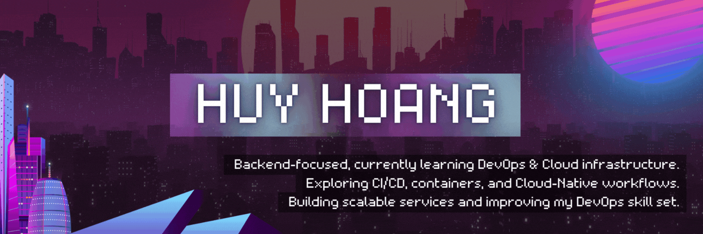

  

 

<table border="0" width="100%">
  <tr>
    <td width="55%" align="center" valign="middle">
      

        
          I'm a <b>Backend Developer</b> with a strong foundation in building scalable, high-performance systems, currently expanding my expertise into <b>DevOps</b> and <b>Cloud Native</b> technologies. 
          I bridge the gap between development and operations to deliver robust, automated, and efficient software solutions.
        
      

    </td>
    <td width="45%" align="center" valign="middle">
      
    </td>
  </tr>
</table>

 

  <h3>Technical Expertise</h3>
  

    <b>Backend Engineering:</b> RESTful APIs, Microservices, System Design, Database Optimization, Distributed Systems 
    <b>DevOps & Cloud:</b> CI/CD Pipelines, Infrastructure as Code (IaC), Containerization (Docker, Kubernetes), Automation, Linux Administration 
    <b>Tools & Languages:</b> Java, Python, TypeScript, Go, AWS, Terraform, Jenkins, GitHub Actions
  

 

  
  
  
  
  &nbsp;&nbsp;&nbsp;&nbsp;
  
  
  
    
  

 

  <table border="0" width="90%">
    <tr>
      <td width="50%" align="center" valign="middle">
        
      </td>
      <td width="50%" align="center" valign="middle">
        <h3>Connect With Me</h3>
        
         
        
         
        
         
      </td>
    </tr>
  </table>

